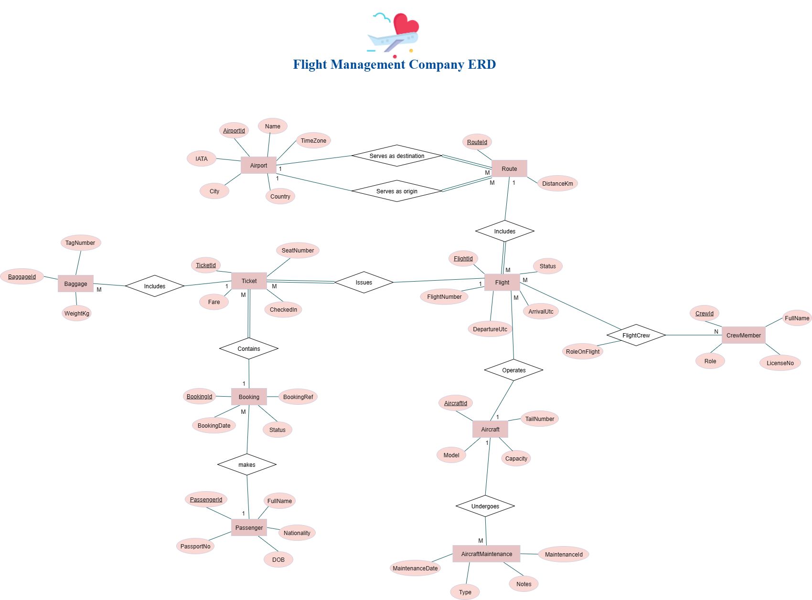

# FlightManagementCompanyProject

## Project Progress Summary
I have analyzed the Flight Management Company backend project requirements and clarified the database structure using an Entity Relationship Diagram.

#### 1. Reviewed Project Specification

- Studied all entities, fields, constraints, and relationships as defined in the project brief.

- Understood business rules, required EF Core implementation details, and LINQ-based service methods.

#### 2. Entity Listing with Attributes

- Documented all 11 core entities: Airport, Route, Aircraft, Flight, CrewMember, FlightCrew, Passenger, Booking, Ticket, Baggage, AircraftMaintenance.

- Included primary keys, foreign keys, unique constraints, and important field details for each.

#### 3. Relationships & Cardinalities

- Defined how entities are connected, ensuring referential integrity.

- Mapped every connection between entities based on the business model.

#### 4. Relationship Verbs (Business Meaning)

- Added clear verbs to describe the relationships.

- This helps bridge the gap between technical schema and business understanding.

#### 5. ERD Drafting

- Created an initial ERD diagram mapping entities and relationships.

- Planned improvements to enhance clarity with relationship verbs on connectors.

#### Airport/ Route 

- An Airport serves as origin for many Routes.

- An Airport serves as destination for many Routes.

#### Route/ Flight

- A Route includes many Flights.

#### Aircraft/ Flight

- An Aircraft operates many Flights.

#### Aircraft/ AircraftMaintenance

- An Aircraft undergoes many Maintenance events.

#### Flight/ Ticket

- A Flight issues many Tickets.

#### Flight/ CrewMember (via FlightCrew)

- A Flight is staffed by many CrewMembers.

- A CrewMember works on many Flights.

#### Passenger/ Booking

- A Passenger makes many Bookings.

#### Booking/ Ticket

- A Booking contains many Tickets.

#### Ticket/ Baggage

- A Ticket includes many pieces of Baggage.

## Normalization 
#### 1) Airport
1NF – Unnormalized (combined “Location”)

| AirportID | IATA | AirportName                   | Location      | TimeZone    |
| --------- | ---- | ----------------------------- | ------------- | ----------- |
| 1         | MCT  | Muscat International Airport  | Muscat, Oman  | Asia/Muscat |
| 2         | SLL  | Salalah International Airport | Salalah, Oman | Asia/Muscat |
| 3         | DXB  | Dubai International Airport   | Dubai, UAE    | Asia/Dubai  |

2NF – Split Location 

| AirportID | IATA | AirportName                   | City    | Country | TimeZone    |
| --------- | ---- | ----------------------------- | ------- | ------- | ----------- |
| 1         | MCT  | Muscat International Airport  | Muscat  | Oman    | Asia/Muscat |
| 2         | SLL  | Salalah International Airport | Salalah | Oman    | Asia/Muscat |
| 3         | DXB  | Dubai International Airport   | Dubai   | UAE     | Asia/Dubai  |

3NF – (Already 3NF).

#### 2) Route
1NF – Unnormalized

| RouteID | Airports | Distance |
| ------- | -------- | -------- |
| 10      | MCT–SLL  | \~870 km |
| 11      | MCT–DXB  | \~340 km |

2NF – Split Airports

| RouteID | OriginIATA | DestIATA | DistanceKm |
| ------- | ---------- | -------- | ---------- |
| 10      | MCT        | SLL      | 870        |
| 11      | MCT        | DXB      | 340        |

3NF – (Already 3NF).

#### 3) Aircraft

1NF – Unnormalized 

| AircraftID | TailNumber | ModelCapacity          |
| ---------- | ---------- | ---------------------- |
| 101        | A4O-BA     | B737-800 / 162 seats   |
| 102        | A4O-BB     | B737 MAX 8 / 174 seats |
| 103        | A4O-CA     | B787-9 / 288 seats     |

2NF 

| AircraftID | TailNumber | Model      | Capacity |
| ---------- | ---------- | ---------- | -------- |
| 101        | A4O-BA     | B737-800   | 162      |
| 102        | A4O-BB     | B737 MAX 8 | 174      |
| 103        | A4O-CA     | B787-9     | 288      |

3NF – Remove transitive dependency

| ModelID | Model      | Manufacturer | TypicalCapacity |
| ------- | ---------- | ------------ | --------------- |
| 1       | B737-800   | Boeing       | 162             |
| 2       | B737 MAX 8 | Boeing       | 174             |
| 3       | B787-9     | Boeing       | 280–296         |

Aircraft (references ModelID)

| AircraftID | TailNumber | ModelID |
| ---------- | ---------- | ------- |
| 101        | A4O-BA     | 1       |
| 102        | A4O-BB     | 2       |
| 103        | A4O-CA     | 3       |

#### 4) Flight

1NF – Unnormalized

| FlightID | FlightNumber | Times (UTC)                  | Route   | Status    | AircraftTail |
| -------- | ------------ | ---------------------------- | ------- | --------- | ------------ |
| 5001     | FM101        | Dep 2025‑08‑20 04:00 → 05:10 | MCT–DXB | Scheduled | A4O-BA       |
| 5002     | FM102        | Dep 2025‑08‑21 06:00 → 07:30 | MCT–SLL | Scheduled | A4O-BB       |

2NF 

| FlightID | FlightNumber | DepartureUtc        | ArrivalUtc          | Status    | RouteID | AircraftID |
| -------- | ------------ | ------------------- | ------------------- | --------- | ------- | ---------- |
| 5001     | FM101        | 2025‑08‑20 04:00:00 | 2025‑08‑20 05:10:00 | Scheduled | 11      | 101        |
| 5002     | FM102        | 2025‑08‑21 06:00:00 | 2025‑08‑21 07:30:00 | Scheduled | 10      | 102        |

3NF – (Already 3NF).

#### 5) Passenger 

1NF – Unnormalized

| PassengerID | FullName       | Passport (Nat/No) | BirthInfo         |
| ----------- | -------------- | ----------------- | ----------------- |
| 9001        | Farid Al‑Alawi | OM / OM1234567    | Oman / 1999‑09‑02 |
| 9002        | Amani Al‑Hinai | OM / OM7654321    | Oman / 2000‑05‑14 |

2NF 

| PassengerID | FullName       | PassportNo | Nationality | DOB        |
| ----------- | -------------- | ---------- | ----------- | ---------- |
| 9001        | Farid Al‑Alawi | OM1234567  | Oman        | 1999‑09‑02 |
| 9002        | Amani Al‑Hinai | OM7654321  | Oman        | 2000‑05‑14 |

3NF – (Already 3NF).

#### 6) Booking

1NF – Unnormalized

| BookingRef   | Passenger | FlightNumber | Seats    | Status    | FareTotal |
| ------------ | --------- | ------------ | -------- | --------- | --------: |
| OM‑FM101‑001 | Farid     | FM101        | 12A, 12B | Confirmed |     90.00 |
| OM‑FM102‑002 | Farid     | FM102        | 14C      | Confirmed |     65.00 |

2NF

Booking

| BookingID | BookingRef   | PassengerID | BookingDate         | Status    |
| --------- | ------------ | ----------- | ------------------- | --------- |
| 7001      | OM‑FM101‑001 | 9001        | 2025‑08‑12 08:00:00 | Confirmed |
| 7002      | OM‑FM102‑002 | 9001        | 2025‑08‑12 08:05:00 | Confirmed |

Ticket

| TicketID | BookingID | FlightID | SeatNumber | Fare  | CheckedIn |
| -------- | --------- | -------- | ---------- | ----- | --------- |
| 8001     | 7001      | 5001     | 12A        | 45.00 | 0         |
| 8002     | 7001      | 5001     | 12B        | 45.00 | 0         |
| 8003     | 7002      | 5002     | 14C        | 65.00 | 0         |

3NF – (Already 3NF).

#### 7) Baggage

1NF – Unnormalized

| TicketID | Baggage (tags/weights)   |
| -------- | ------------------------ |
| 8001     | MCT001/18.5, MCT002/10.2 |
| 8003     | MCT003/23.0              |

2NF - One bag per row 

| BaggageID | TicketID | TagNumber | WeightKg |
| --------- | -------- | --------- | -------- |
| 6001      | 8001     | MCT001    | 18.50    |
| 6002      | 8001     | MCT002    | 10.20    |
| 6003      | 8003     | MCT003    | 23.00    |

3NF – (Already 3NF). 